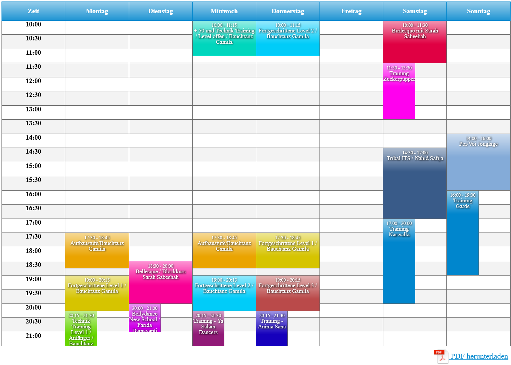

# Scheduler

A WordPress plugin for creating and managing weekly schedules. Noteworthy features include:
- optimal arrangement of weekly events in a tabular structure as long as no more than 3 events take place in parallel
- visually pleasing *Lightbox* overlays when clicking on an event in the schedule
- automatic generation of a downloadable PDF file for the displayed schedule

## Installation

Download the ZIP file from the latest release and install it as plugin in WordPress.

## Example

